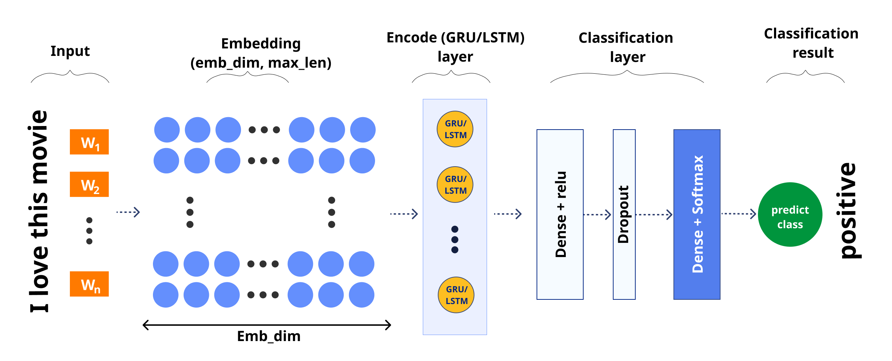

# Gated Reccurrent Unit Application in Sentiment Analysis
Implemention for Empirical Evaluation of Gated Recurrent Neural Networks on Sequence Modeling. Read the paper [here](https://arxiv.org/pdf/1412.3555.pdf).

<p align="center">
    
</p>

Compare and evaluate recurrent neural networks (RNN) with different types of recurrent units: 
- Gated recurrent unit (GRU)
- Long short-term memory (LSTM)
- Hyperbolic tangent (tanh)

We also implement our project in [Vietnamese](https://docs.google.com/document/d/1GHZIDAyfCL2O-PVPVyQJdcQ8FxdkPGA4-AQd3cCYoMQ/edit?usp=sharing).

Architecture Used
<p align="center">
    
</p>

Advisor: [Ngoc Nguyen](https://github.com/bangoc123)

Authors: [Duong Tran](https://github.com/ttduongtran), [Dung Nguyen](https://github.com/anhdungpro97), [Sang Nguyen](https://github.com/joeeislovely)


## I.  Setup Environment

- Step 1: Create the environment (Make sure you have installed the lastest [Miniconda](https://docs.conda.io/en/latest/miniconda.html))

```python
conda env create -f environment.yml
```

- Step 2: Activate the environment
```
conda activate gru
```

## II.  Set up your dataset

- Your dataset must be a `.csv` file.
- You should remember the directory where you put the dataset in order to use it for training.
	+ The default directory is `../data/..`.
	+ For example: `../data/IMDB_Dataset.csv`.
- You can use the default `IMDB_Dataset.csv` or `IMDB_Dataset_mini.csv` which are available in `../data`.
- More about the IMDB_Dataset at [Kaggle](https://www.kaggle.com/lakshmi25npathi/imdb-dataset-of-50k-movie-reviews). 

- If you use another dataset, remember that your dataset should be same as this architecture.

| data_name   |   data_label      |
|----------|:-------------:|
| Training sentence 1       |  label 1|
| Trainning sentence 2              |    label 2 |
| ...              |    ... |

- For example: `IMDB_Dataset.csv`

| review   |   sentiment      |
|----------|:-------------:|
| What a disappointment! Piper Perabo...       |  negative|
| I love this movie. It was one of my favorite m...             |    positive |
| ...              |    ... |
	

- References: [ProtonX-Transformer](https://github.com/bangoc123/transformer) and [ProtonX-NLPMixer](https://github.com/bangoc123/mlp-mixer)

## III. Training Process

Training script:


```python

!python train.py --epochs ${epochs} 
                --model-folder ${model_folder}
                --checkpoint-folder ${checkpoint_folder}
                --data-path ${data_path}
                --data-name ${data_name}
                --label-name ${label_name}
                --data-classes ${data_classes}
                --num-class ${num_classes}
                --model ${model} 
                --units ${units}
                --embedding-size ${embedding_size}
                --vocab-size ${vocab_size}
                --max-length ${max_length}
                --learning-rate ${learning_rate}
                --optimizer ${optimizer}
                --test-size ${test_size}
                --batch-size ${batch_size}
                --buffer-size ${buffer_size}

```

Example for `IMDB dataset`:

```python
!python train.py --epochs 20 --model gru --optimizer rmsprop --units 128 --embedding-size 128 --vocab-size=10000 --max-length 256 --learning-rate 0.0008  --test-size 0.2 --batch-size 32 --buffer-size 128
```

Example for others dataset:

```python
!python train.py --epochs 20 --model gru --learning-rate 0.0008 --optimizer rmsprop --model-folder /tmp/model/ --checkpoint-folder /tmp/checkpoints/ --data-path data/IMDB_Dataset.csv --data-name review  --label-name sentiment --data-classes {'negative': 0, 'positive': 1} --num-class 2 --units 128 --embedding-size 128 --vocab-size=10000 --max-length 256  --test-size 0.2 --batch-size 32 --buffer-size 128
```


There are some `important` arguments for the script you should consider when running it:
- `model-folder`: Directory model. (E.g. `tmp/model`)
- `checkpoint-folder`: Directory checkpoints. (E.g. `tmp/checkpoints`)
- `data-path`: The path of dataset (Must be csv format. E.g. `data/IMDB_Dataset.csv`)
- `data-name`: The folder of validation data
- `data-name`: Name of data column that having sentences will be train. (e.g. `review`)
- `label-name`:  Name of label column that having labels will be train. (e.g. `sentiment` )
- `data-classes`: Set of labels that you need to convert to categorical. (E.g. `{'negative': 0, 'positive': 1}`)
- `num-class`: Number of labels in your dataset. (e.g. `2` labels)
- `model`: Choose one model that you want to test including: `gru`, `lstm`, `tanh`. Default is `gru`
- `units`: Hidden dimension. Default is `128`
- `embedding-size`: Embedding dimension. Default is `128`
- `vocab-size`: Vocabulary size. Default is `10000`
- `max-length`: The maximum length of a sentence you want to keep when preprocessing. Default value `256`
- `learning-rate`: Learning rate. Default is `0.005`
- `optimizer`: Choose one optimizer that you want to apply, including: `rmsprop` and `adam`. Default is `rmsprop`
- `test-size`: Split to train (1-x) and test (x) dataset with ratio. Default is `0.2`
- `batch-size`: The batch size of the dataset. Default value `64`

## IV. Prediction Process

Ensure you already have trained for the `tmp/model/${model}` was created after successful training process. Use the script below to predict:

```python

!python predict.py --review-sentence ${The review sentence} 
                --model-path ${model directory}
                --data-path ${data_path}
                --data-name ${data_name}
                --data-classes ${data_classes}       
                --vocab-size ${vocab_size}
                --max-length ${max_length}

```
Using GRU model for predictions:

```python
!python predict.py --model-path tmp/model/gru.h5py --review-sentence "The plot of film is really good"
```

Other predictions with LSTM:

```python
!python predict.py --model-path tmp/model/lstm.h5py --review-sentence "The plot of film is really good"
```

## V. Result and Comparision

The arguments that we used for train:
- epoch: `10`
- loss: `rmsprop`
- metrics: `['accuracy', 'mse']`

### 1. GRU
```
...
Epoch 6/10
1250/1250 [==============================] - 325s 260ms/step - loss: 0.1785 - accuracy: 0.9317 - mse: 0.0511 - val_loss: 0.3023 - val_accuracy: 0.8936 - val_mse: 0.0836
Epoch 7/10
1250/1250 [==============================] - 326s 261ms/step - loss: 0.1621 - accuracy: 0.9388 - mse: 0.0459 - val_loss: 0.3329 - val_accuracy: 0.8818 - val_mse: 0.0924
Epoch 8/10
1250/1250 [==============================] - 326s 261ms/step - loss: 0.1460 - accuracy: 0.9434 - mse: 0.0414 - val_loss: 0.3247 - val_accuracy: 0.8863 - val_mse: 0.0864
Epoch 9/10
1250/1250 [==============================] - 323s 258ms/step - loss: 0.1310 - accuracy: 0.9507 - mse: 0.0368 - val_loss: 0.3278 - val_accuracy: 0.8841 - val_mse: 0.0878
Epoch 10/10
1250/1250 [==============================] - 322s 258ms/step - loss: 0.1149 - accuracy: 0.9572 - mse: 0.0318 - val_loss: 0.3633 - val_accuracy: 0.8818 - val_mse: 0.0919

```

### 2. LSTM
```
...
Epoch 6/10
1250/1250 [==============================] - 352s 281ms/step - loss: 0.4320 - accuracy: 0.8328 - mse: 0.1327 - val_loss: 0.4471 - val_accuracy: 0.8203 - val_mse: 0.1405
Epoch 7/10
1250/1250 [==============================] - 350s 280ms/step - loss: 0.4057 - accuracy: 0.8458 - mse: 0.1232 - val_loss: 0.4552 - val_accuracy: 0.8326 - val_mse: 0.1386
Epoch 8/10
1250/1250 [==============================] - 350s 280ms/step - loss: 0.3847 - accuracy: 0.8532 - mse: 0.1166 - val_loss: 0.4161 - val_accuracy: 0.8353 - val_mse: 0.1303
Epoch 9/10
1250/1250 [==============================] - 349s 280ms/step - loss: 0.3255 - accuracy: 0.8714 - mse: 0.0977 - val_loss: 0.3246 - val_accuracy: 0.8581 - val_mse: 0.0993
Epoch 10/10
1250/1250 [==============================] - 350s 280ms/step - loss: 0.2795 - accuracy: 0.8878 - mse: 0.0830 - val_loss: 0.3019 - val_accuracy: 0.8795 - val_mse: 0.0905

```
### 3. TANH
```
...
Epoch 6/10
1250/1250 [==============================] - 103s 83ms/step - loss: 0.6915 - accuracy: 0.5132 - mse: 0.2491 - val_loss: 0.6915 - val_accuracy: 0.5115 - val_mse: 0.2492
Epoch 7/10
1250/1250 [==============================] - 103s 82ms/step - loss: 0.6851 - accuracy: 0.5284 - mse: 0.2460 - val_loss: 0.6787 - val_accuracy: 0.5420 - val_mse: 0.2428
Epoch 8/10
1250/1250 [==============================] - 103s 82ms/step - loss: 0.6713 - accuracy: 0.5501 - mse: 0.2395 - val_loss: 0.6785 - val_accuracy: 0.5443 - val_mse: 0.2427
Epoch 9/10
1250/1250 [==============================] - 103s 82ms/step - loss: 0.6715 - accuracy: 0.5508 - mse: 0.2396 - val_loss: 0.6908 - val_accuracy: 0.5250 - val_mse: 0.2485
Epoch 10/10
1250/1250 [==============================] - 103s 82ms/step - loss: 0.6731 - accuracy: 0.5497 - mse: 0.2403 - val_loss: 0.6936 - val_accuracy: 0.5233 - val_mse: 0.2494

```

### 4. Results

- Base on the results of Training with 3 kinds of model, we explored that there are differences about the accuracy:
	+ Both GRU and LSTM have high efficiency with the highest `val_accuracy` is 0.8936 and 0.8795, respectively.    
	+ The tanh model is the opposite, which its `val_accuracy` is really low with just around 0.54 
- The results clearly demonstrated the superiority of the gated-RNN units; both the LSTM unit and GRU, over the traditional tanh method.
- However, we cannot make a concrete conclusion on which of the two gating units was better.

<!-- ## VI. Running Test

When you want to modify the model, you need to run the test to make sure your change does not affect the whole system.

In the `./folder-name` **(FIXME)** folder please run:

```bash
pytest
``` -->


